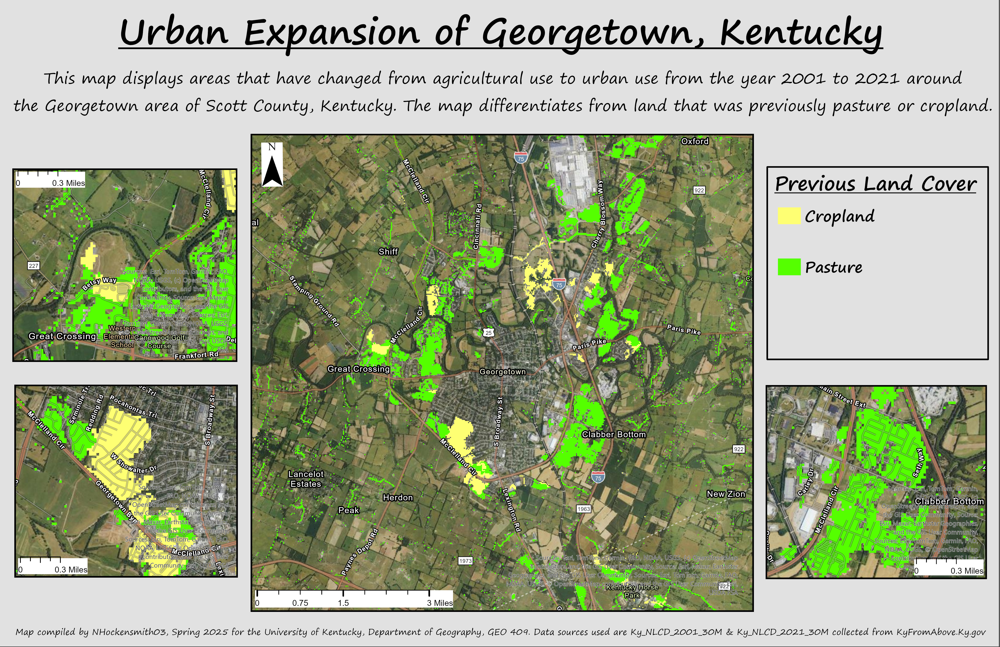

# Urban Expansion of Georgetown, Kentucky

## This map displays areas that have changed from agricultural use to urban use from the year 2001 to 2021 around the Georgetown area of Scott County, Kentucky. The map differentiates from land that was previously pasture or cropland.

The population of Georgtown, Kentucky has risen from 18,694 in 2001 to 37,730 in 2021. This rapid population growth has lead to a quick expanion of the urban area outward which can be seen by the loss of agricultural land from 2001 to 2021 suronding Georgetown.

  
_This map displays the loss of agricultural land around Georgetown, Kentucky from Urban Expansion_

[Link to high-resolution version](gtown_expansion.pdf)

Map compiled by NHockensmith03, Spring 2025 for the University of Kentucky, Department of Geography, GEO 409. Data sources used are Ky_NLCD_2001_30M & Ky_NLCD_2021_30M collected from KyFromAbove.Ky.gov 